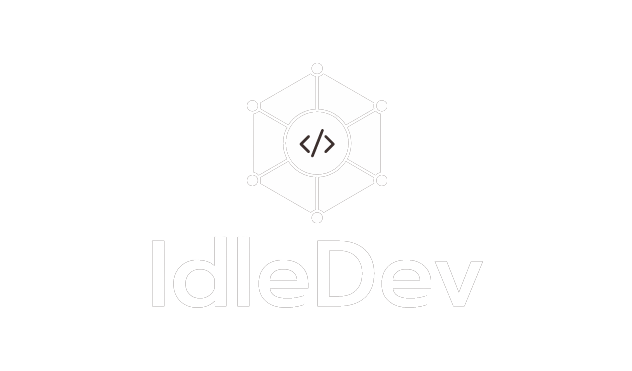

# IdleDev Back

Backend del juego idle IdleDev en el que irás desbloqueando tecnologías a medida que vas consiguiendo dinero.

## Requisitos para local

* Java 11
* MySQL workbench
* IntelliJ Idea

## Despliegue

Esta api se encuentra desplegada en railway y asegurada mediante seguridad JWT, siendo su enlace base https://idle-dev-back.up.railway.app

## Cómo empezar en local

1. Una vez descargado el repositorio cargar la base de datos de la carpeta resources BD-FINAL en MySQL workbench
2. Realizar la conexión con la base de datos desde intelliJ
3. Cambiar los enlaces de application.properties, comentar los de producción y descomentar los de desarrollo, cambiando usuario y contraseña por los usados en la conexión de MySQL
4. Para que no de problemas al subir avatar ir a controllers->usuarios y cambiar la función de PUT, comentar las lineas de  ”Production” y descomentar las de "Local"
5. Por último también realizar el cambio en el servicio que genera imágenes de trabajadores en servicios -> TrabajadoresServices, comentar el link de producción y descomentar el de Dev
### Es MUY importante NO se use el backend local con la base de datos desplegada, ya que al usar la subida de imágenes estas se subirán corruptas ya que se subirán con el enlace de http:// localhost

## Endpoints

### Autenticación

| Endpoint                                  | Resultado                                                               | Método   |
|------------------------------------------ |-------------------------------------------------------------------------|:--------:|
|`/login`                                   | Realiza el login y si es correcto devuelve un token                     | POST     |
|`/registro`                                | Función de registro de usuario                                          | POST     |

### Empresas

| Endpoint                                  | Resultado                                                               | Método   |
|------------------------------------------ |-------------------------------------------------------------------------|:--------:|
|`/empresas`                                | Muestra todas las empresas                                              | GET      |
|`/empresa/{id}`                            | Muestra una empresa concreta                                            | GET      |

### Mejoras

| Endpoint                                  | Resultado                                                               | Método   |
|------------------------------------------ |-------------------------------------------------------------------------|:--------:|
|`/mejoras`                                 | Muestra todas las mejoras                                               | GET      |
|`/mejora/{id}`                             | Muestra una mejora concreta                                             | GET      |
|`/mejora/{id}`                             | Solo para la subida de logos a la BD                                    | PUT      |
 
### Lenguajes

| Endpoint                                  | Resultado                                                               | Método   |
|------------------------------------------ |-------------------------------------------------------------------------|:--------:|
|`/lenguajes`                               | Muestra todos los lenguajes                                             | GET      |
|`/lenguaje/{id}`                           | Muestra un lenguaje concreto                                            | GET      |
|`/lenguaje/{id}/mejoras`                   | Muestra las mejoras de un lenguaje concreto                             | GET      |
|`/lenguaje/{id}`                           | Solo para la subida de logos a la BD                                    | PUT      |

### Usuarios

| Endpoint                                  | Resultado                                                               | Método   |
|------------------------------------------ |-------------------------------------------------------------------------|:--------:|
|`/usuarios`                                | Muestra todos los usuarios                                              | GET      |
|`/usuario/{nombre}`                        | Muestra un usuario concreto. Funciona con el nombre de usuario          | GET      |
|`/usuario/{id}`                            | Actualiza los datos de un usuario(p.e. cambio contraseña)               | PUT      |

### Partidas

| Endpoint                                  | Resultado                                                               | Método   |
|------------------------------------------ |-------------------------------------------------------------------------|:--------:|
|`/clasificacion`                           | Muestra la clasificacion de partidas                                    | GET      |
|`/partida/{id}`                            | Muestra una partida concreta                                            | GET      |
|`/partida`                                 | Crea una nueva partida                                                  | POST     |
|`/partida/{id}`                            | Actualiza los datos de una partida                                      | PUT      |

### Trabajador-lenguaje

| Endpoint                                  | Resultado                                                               | Método   |
|------------------------------------------ |-------------------------------------------------------------------------|:--------:|
|`/lenguaje/{id}/trabajadores`              | Muestra todos los trabajadores de un lenguaje concreto                  | GET      |
|`/trabajador/{id}/lenguajes`               | Muestra todos los lenguajes de un trabajador concreto                   | GET      |
|`/trabajador-lenguaje`                     | Crea una nueva relación                                                 | POST     |
|`/trabajador-lenguaje/{id}`                | Actualiza la relación                                                   | PUT      |

### Trabajador

| Endpoint                                  | Resultado                                                               | Método   |
|------------------------------------------ |-------------------------------------------------------------------------|:--------:|
|`/trabajador`                              | Muestra todos los trabajadores                                          | GET      |
|`/trabajador/{id}`                         | Muestra un trabajador concreto                                          | GET      |
|`/trabajadores/{partidaId}`                | Muestra todos los trabajadores de una partida                           | GET      |
|`/trabajador/{id}`                         | Añade un nuevo trabajador                                               | POST     |
|`/trabajador/{id}`                         | Actualiza los datos de un usuario(p.e. las mejoras adquiridas)          | PUT      |

### Lenguaje-partida 

| Endpoint                                  | Resultado                                                               | Método   |
|------------------------------------------ |-------------------------------------------------------------------------|:--------:|
|`/partida/{id}/lenguajes`                  | Muestra los lenguajes de una partida                                    | GET      |
|`/lenguaje-partida`                        | Crea un nuevo registro de lenguaje en una partida                       | POST     |
|`/lenguaje-partida/{id}`                   | Actualiza la informacion de un lenguaje en una partida                  | PUT      |

### Empresa-partida

| Endpoint                                  | Resultado                                                               | Método   |
|------------------------------------------ |-------------------------------------------------------------------------|:--------:|
|`/partida/{id}/empresas`                   | Muestra las empresas de una partida                                     | GET      |
|`/empresa-partida/{id}`                    | Crea un nuevo registro de empresa en una partida                        | POST     |
|`/empresa-partida/{id}`                    | Actualiza la informacion de una empresa en una partida                  | PUT      |

### Trabajador-mejora

| Endpoint                                  | Resultado                                                                | Método   |
|------------------------------------------ |--------------------------------------------------------------------------|:--------:|
|`/trabajador/{id}/mejoras`                 | Muestra las mejoras de un trabajor                                       | GET      |
|`/trabajador-mejora`                       | Crea un nuevo registro de mejora en un trabajador                        | POST     |
|`/trabajador-mejora/{id}`                  | Actualiza la informacion de una mejora en un trabajador                  | PUT      |

| Endpoint                                  | Resultado                                                                             | Método   |
|------------------------------------------ |---------------------------------------------------------------------------------------|:--------:|
|`/partida/{id}`                            | Aqui se recuperarán los datos de una partida, es aqui donde se usara el DTO completo  | GET      |
|`/partida/{id}`                            | Crea  los datos de una partida nueva                                                  | POST     |
|`/partida/{id}`                            | Actualiza la informacion de una partida(Guardar partida)                              | PUT      |

